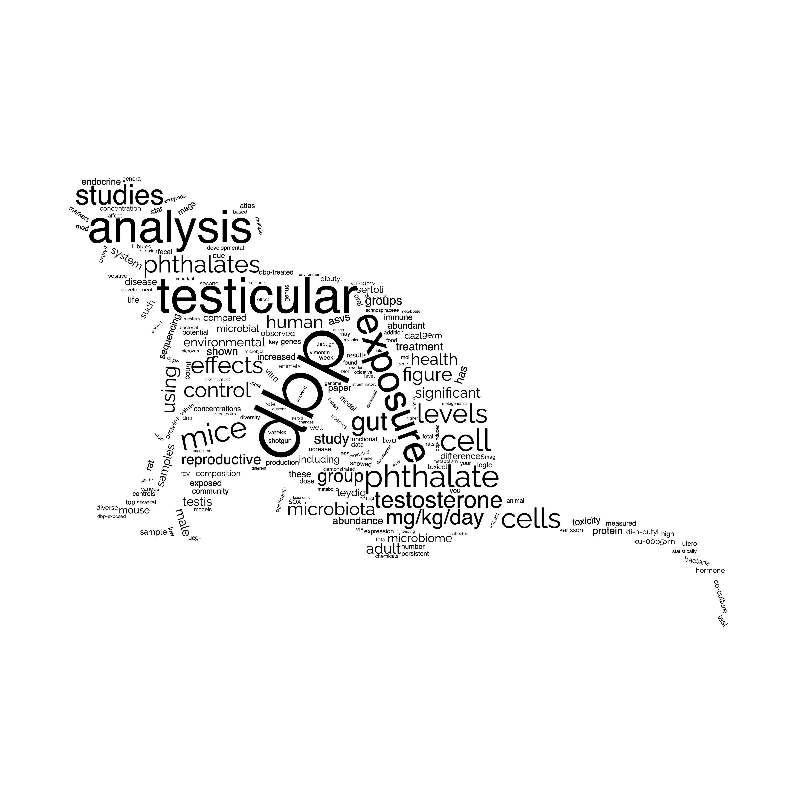

# README

This repository creates a weighted list ([wordcloud](https://en.wikipedia.org/wiki/Tag_cloud)) from pdf-files. I use this for creating wordclouds based on PhD theses.

## Generate weighted list

Place the PDFs inside the `doc/` folder, run the `bin/frequency-table.R`. This generates `data/wordcloud.csv`. Use this file to create a wordcloud at www.wordclouds.com

Example wordcloud:

{ width=50% }

## File structure

```
proj/
|-- bin/
|   `-- frequency-table.R
|-- doc/
|-- data/
|-- img/
|   `-- wordcloud.png
`-- README.md
```

<!--

Homepage where a word frequency table is imported and a cloud is made based on a shape. plus much more https://www.wordclouds.com/

# references
+ https://cran.r-project.org/web/packages/ggwordcloud/vignettes/ggwordcloud.html
+ https://towardsdatascience.com/create-a-word-cloud-with-r-bde3e7422e8a
+ https://www.geeksforgeeks.org/generating-word-cloud-in-r-programming/
+ [pdf_to_text](https://data.library.virginia.edu/reading-pdf-files-into-r-for-text-mining/)
+ [pdf_to_text2](https://stackoverflow.com/questions/21445659/use-r-to-convert-pdf-files-to-text-files-for-text-mining)
+ [pdf_to_test3](https://www.r-bloggers.com/2021/06/extract-text-from-pdf-in-r-and-word-detection/)
+ [change_background_shape](https://cran.r-project.org/web/packages/wordcloud2/vignettes/wordcloud.html#lettercloud-function)

-->